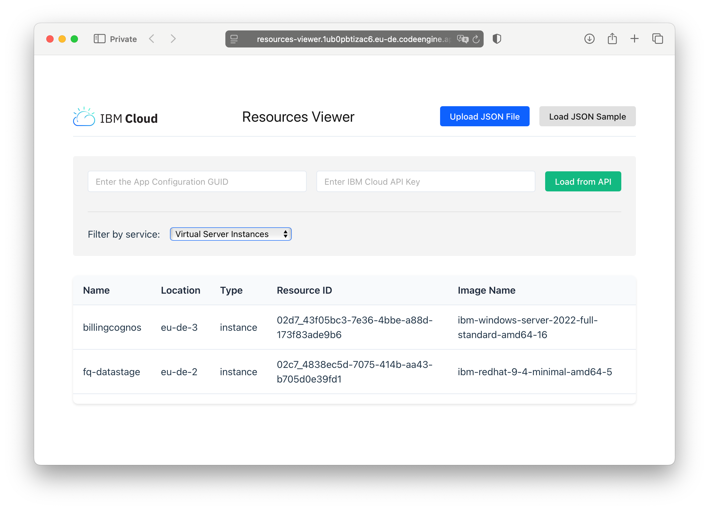

# README

App is built with React + TypeScript + Vite.



## Run the app locally

1. Run it!

    ```sh
    npm run dev
    ```

## Build and push the docker image locally

1. Build image

  ```sh
  podman build --no-cache --platform linux/amd64 -t de.icr.io/mace2/resources-viewer:latest .
  ```

  > Warning: Code Engine only supports amd64 architecture.

1. Push the image

  ```sh
  podman push de.icr.io/mace2/resources-viewer:latest
  ```

## Build and Deploy the app in Code Engine 

1. Create a Code Engine project

    ```sh
    ibmcloud ce project create --name resources-viewer-project
    ```

1. Select the project

    ```sh
    ibmcloud ce project select --name resources-viewer-project
    ```

1. Create a secret to access the IBM Container Registry

    ```sh
    ibmcloud ce registry create --name icr-access --server de.icr.io --username iamapikey --password $API_KEY
    ```

1. Create the serverless app

  ```sh
  ibmcloud ce application create --name resources-viewer \
    --image de.icr.io/mace2/resources-viewer:amd64 \
    --port 8080 \
    --cpu 0.125 \
    --memory 250M \
    --min-scale 1 \
    --max-scale 1 \
    --registry-secret icr-access
  ```

1. After deployment, you can check the application status

    ```ssh
    ibmcloud ce application get -n resources-viewer
    ```


## Backup

1. Let's use Code Engine's build feature to handle the cross-architecture compilation directly in the cloud.

    ```sh
    ibmcloud ce build create \
      --name resources-viewer-build \
      --source https://github.com/lionelmace/resources-viewer.git \
      --strategy dockerfile \
      --size medium \
      --image de.icr.io/mace2/resources-viewer:amd64 \
      --registry-secret icr-access
    ```

1. After creating the build, you'll need to create an application in Code Engine to run your container. Here's the command to deploy your application:

    ```sh
    ibmcloud ce application create \
      --name resources-viewer \
      --image de.icr.io/mace2/resources-viewer:amd64 \
      --registry-secret icr-access \
      --port 3000
    ```

1. After deployment, you can check the application status

    ```ssh
    ibmcloud ce application get -n resources-viewer
    ```

1. Update the build

    ```sh
    ic ce build update --name resources-viewer-build
    ```

1. View logs of the revision

    ```sh
    ibmcloud ce revision logs -n resources-viewer-00002
    ```